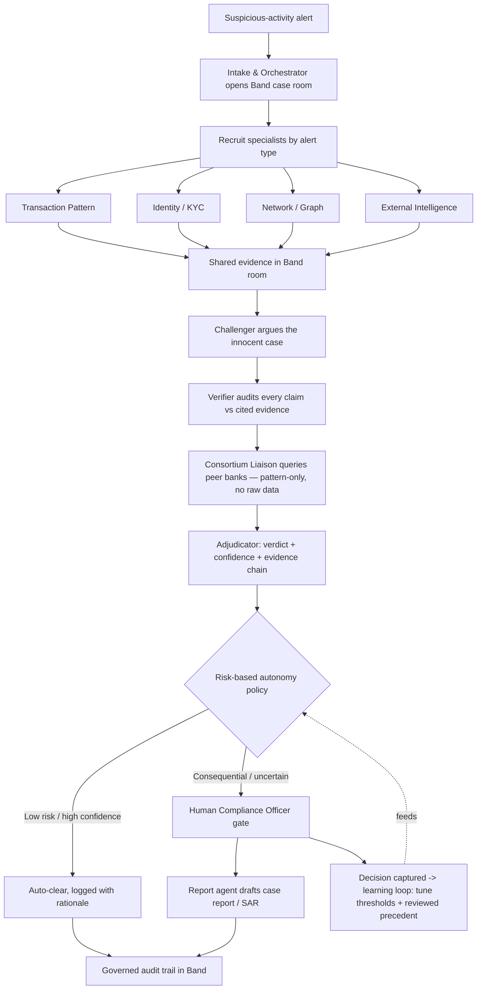

# AEGIS — A Self-Verifying, Autonomous Financial-Crime Investigation Mesh

> **Revision note (v2).** Full scope preserved — all 10 agents, the consortium, the feedback loop,
> the dashboard. This revision does **not** cut anything; it fixes the things a judge would dock hardest
> and adds the depth that turns "ambitious" into "winning": a **credible accuracy claim on a public
> benchmark** (instead of a self-graded one), each agent made **defensibly distinct**, the
> cross-institution feature made **provable on screen**, a **credit budget**, and a **demo-resilience plan**.

**Dual submission:**
- **Band of Agents Hackathon** (lablab.ai × Band) — Track 3, Regulated & High-Stakes — closes **June 19, 2026, 8:30 PM IST**
- **FAR AWAY 2026** — Theme: Agentic & Autonomous Systems — closes **June 14, 2026, 11:59 PM IST**

AEGIS = **A**gent-based **E**vidence-**G**rounded **I**nvestigation **S**ystem. *(Commit to one name before submission — "AEGIS" is memorable; stop carrying placeholders into the deck.)*

**One-line pitch:** Anti-money-laundering systems bury analysts under false alarms because one model guesses in a single pass. AEGIS replaces the guess with an autonomous team of specialist agents that investigate from different angles, *argue against each other*, refuse to issue any verdict that isn't backed by evidence, decide low-risk cases on their own, escalate only what truly matters to a human, and learn from every decision — coordinated, governed, and audited through Band, and able to strengthen its judgment using patterns shared by peer banks *without any customer data ever crossing a boundary.*

---

## 0. How to Read This Doc — What Each Hackathon Needs

This is one project submitted to two hackathons. We build the **full** system; each hackathon emphasizes a different face of it.

|                       | Band of Agents                                                                 | FAR AWAY 2026                                                                          |
|-----------------------|--------------------------------------------------------------------------------|---------------------------------------------------------------------------------------|
| Submission slot       | Track 3 (Regulated & High-Stakes)                                              | Theme: Agentic & Autonomous Systems                                                    |
| Deadline              | June 19, 8:30 PM IST                                                            | June 14, 11:59 PM IST                                                                  |
| What it rewards       | Band as the coordination layer; agent-to-agent collaboration; governance/audit | Innovation & technical depth, engineering quality, real-world impact, scalability, UX, execution |
| The face we show      | Cross-framework, governed, cross-institution mesh on Band                       | Autonomy ("think, decide, act independently"), **measured accuracy gain on public data**, engineering, working MVP |
| Mandatory deliverables| GitHub repo, video, slides, cover image, short+long description, tags, demo app URL | GitHub repo, presentation (≤15 slides) OR video (2–5 min), PCB/CAD (N/A — software)    |

The union of all required deliverables is in **Section 13**. Because FAR AWAY closes first (June 14), we treat that date as a checkpoint where the **single-institution core + accuracy demo + dashboard** is live; the cross-institution feature and final polish land by the June 19 Band deadline. We are not trimming the solution — only sequencing it.

> **⚠️ Pre-flight before you rely on the dual strategy (Section 18):**
> 1. Confirm **both hackathons permit the same project** to be submitted to each. Some explicitly forbid it — *verify the rules first.*
> 2. Confirm **Band's exact minimum agent count** and required deliverables from the official rules/kickoff.
> 3. Confirm **FAR AWAY's policy on AI-assisted / AI-generated code** (most allow it; verify).

### Table of Contents
1. Problem Statement
2. Solution Overview
3. What Makes It Novel
4. Why Band Is Essential (Band hackathon)
5. The Agent Roster
6. Architecture & Case Flow
7. Headline Feature: Consortium Defense Without Data Sharing
8. Depth Additions: Autonomy, Feedback Loop, Observability
9. **Accuracy Methodology — Public Benchmark + Honest Baseline** *(new — the credibility fix)*
10. Technology Stack
11. What We Build — Work Breakdown
12. Judging-Criteria Alignment — Both Hackathons
13. Submission Deliverables — Both Hackathons (union)
14. Build Plan & Timeline
15. **Credit Budget & Cost Control** *(new)*
16. **Demo Resilience Plan** *(new)*
17. Repository Structure & Conventions
18. Pre-Flight Checklist, Team Roles & Risks
19. Notes for Claude Code CLI

---

## 1. Problem Statement

Every large bank must monitor transactions for money laundering and report suspicious activity. The systems that flag this activity produce a flood of alerts, the overwhelming majority of which are false alarms. Banks throw large teams of human analysts at the backlog — each alert investigated by hand: pull the transaction history, check the customer profile, look for connected accounts, write a verdict.

The result is **slow** (real suspicious activity waits in a queue), **expensive** (financial-crime compliance is one of banking's largest operational costs), **inconsistent** (two analysts disagree on the same case), and **still inaccurate** (criminals slip through while analysts burn hours on the innocent).

Today's AI tools mostly do **single-pass scoring** — one model emits a risk number with no reasoning, no evidence, and no auditability. No compliance officer trusts it enough to act, so the human re-does the investigation anyway.

**The real failure isn't "not enough AI" — it's that one model guessing once is the wrong shape for the job.** Investigation is a team activity: specialists, challenge, verification, a documented chain of evidence, and a judgment about which cases a human even needs to see. That is precisely what an autonomous, governed multi-agent system can do — and precisely what has not been built.

---

## 2. Solution Overview

AEGIS handles each alert as a **case** worked by an autonomous team of specialist agents that check each other's work. It does not emit a number; it produces a **verdict, a confidence level, a complete evidence chain, and a decision about whether a human is even required** — and it learns from every human decision it does request.

Five design choices give it accuracy and genuine autonomy that single-model tools lack:

1. **Division of labor** — separate agents each investigate one angle (transactions, identity, network, external intelligence). Each is small, focused, and — critically — **backed by its own distinct machinery** (a statistical pattern engine, a real entity graph, a vector knowledge base), not just a different prompt. *(See Section 5's "are these real agents?" note — this is what survives a judge's probe.)*
2. **Adversarial challenge** — a dedicated **Challenger** agent actively tries to *disprove* the suspicion and surface the innocent explanation. A suspicion that survives a real attempt to break it is far more likely to be real. **This is the single biggest lever against false positives** and the heart of the system.
3. **Evidence-grounded verification** — a **Verifier** agent refuses to pass any conclusion whose every claim isn't backed by a cited piece of evidence. No evidence, no verdict.
4. **Risk-based autonomy** — the system decides for itself: confidently-benign cases are auto-cleared (with a logged, auditable rationale), and only genuinely consequential or uncertain cases are escalated to a human. This is what "think, decide, and act independently" means in practice — and it's what makes the system actually *reduce* human workload.
5. **Learning from decisions** — every human approve/reject is captured and fed back to tune escalation thresholds and to serve as reviewed precedent the agents can retrieve. The system gets sharper the more it's used.

The output is something a regulated institution can act on: not a black box, but a reasoned, contested, evidence-backed recommendation with a full audit trail — and a system that quietly clears the easy cases on its own.

**This is trustworthy *because* verification and human-gated escalation are its design, not in spite of automation.** It never silently takes an irreversible consequential action; it prepares a defensible case and escalates the decisions that matter.

---

## 3. What Makes It Novel

Individual pieces exist (transaction monitoring, graph analytics, AI scoring). What has **not** shipped is the combination:

- **Adversarial multi-agent verification** as the accuracy mechanism (not one-pass scoring).
- **Risk-based autonomous triage** that clears the easy cases and escalates only the hard ones, with a full rationale.
- **A learning loop** from real human decisions.
- **Cross-institution collaborative defense without data sharing** (Section 7) — the headline.
- **A measured improvement on a public AML benchmark** (Section 9) — not a self-graded claim.

That integration is the originality for both hackathons: for FAR AWAY it's "innovation + technical depth + real-world impact + autonomy," and for Band it's "what becomes possible when governed agents discover and coordinate across frameworks and organizations."

---

## 4. Why Band Is Essential (Band hackathon)

The test we used: *if one team can own all the agents in one process, Band is just decoration.* AEGIS fails that test in the right way:

- **Different owners, different systems.** The specialists naturally wrap independent systems; we build them in *different frameworks* (CrewAI + LangGraph) and have them meet on Band rather than hand-wire one graph — which also scores cross-framework interoperability.
- **Credential traversal is the trust story.** Band propagates the human case officer's permissions across agents, so each agent only touches data the officer is allowed to see. In financial crime that's not optional — it's the line between a usable system and a compliance violation. A single process has no notion of this.
- **Governance + audit are the deliverable.** Band's governed record of every agent interaction *is* the audit trail a regulator wants.
- **Cross-institution collaboration is impossible without it.** The headline feature needs *different banks'* agents to coordinate — no one owns the others' systems, so only a neutral mesh can do it.

> **Engineering principle (also a resilience win):** Agent *logic* is decoupled from Band *transport* via a thin `band/` interface. Band is the coordination, credential, and governance layer wrapped around an agent system that can also run against a local stub. This keeps the mesh layer independently buildable, makes testing trivial, and means a Band hiccup on demo day doesn't take the whole system down — the autonomy/verification story still runs for FAR AWAY (which doesn't require Band).

*(For the FAR AWAY pitch, Band is presented as one implementation choice and the autonomy/accuracy/engineering is foregrounded; for Band, Band's role is the centerpiece.)*

---

## 5. The Agent Roster

Ten agents across two frameworks plus a coding agent, with a human approval gate. (Band's minimum is a small number of collaborating agents — verify the exact count; we exceed it with *meaningful* roles.)

| # | Agent | Role | Framework | Model tier |
|---|-------|------|-----------|------------|
| 1 | **Intake & Orchestrator** | Receives the alert, opens a Band case room, recruits the right specialists for this alert type, manages case state | CrewAI | AI/ML API (reasoning) |
| 2 | **Transaction Pattern** | Sequences, velocity, structuring/smurfing, round-tripping — backed by a **statistical pattern engine** | CrewAI | Featherless (OSS) |
| 3 | **Identity / KYC** | Actual behavior vs. expected profile; sanctions/PEP context (synthetic) | CrewAI | Featherless (OSS) |
| 4 | **Network / Graph** | Entity graph, rings, shared counterparties, mule structures — backed by a **real NetworkX graph** | CrewAI | Featherless (OSS) + graph store |
| 5 | **External Intelligence** | Adverse-media & typology retrieval from a curated corpus — backed by a **vector store (RAG)** | CrewAI | Featherless (OSS) + vector store |
| 6 | **Challenger (Red-Team)** | Adversarially argues the innocent explanation; tries to break the suspicion | LangGraph | AI/ML API (strong reasoning) |
| 7 | **Verifier / Evidence Auditor** | Rejects any claim not backed by cited evidence; assigns per-claim confidence | LangGraph | AI/ML API (strong reasoning) |
| 8 | **Adjudicator** | Synthesizes the deliberation into verdict + confidence + recommended action; applies the risk-based autonomy policy | LangGraph | AI/ML API (reasoning) |
| 9 | **Report / Tooling (coding)** | Writes ad-hoc data queries on demand and drafts the case report / SAR | Codeband | Featherless + AI/ML API |
| 10 | **Consortium Liaison** | Shares/queries crime patterns with peer-bank agents through Band, *no raw data* | Band-native | Featherless (OSS) |
| — | **Compliance Officer (human)** | Approves/rejects escalated cases via Band's human-in-the-loop gate; decisions feed the learning loop | — | — |

**Model allocation:** heavy-judgment agents (Orchestrator, Challenger, Verifier, Adjudicator) use **AI/ML API** frontier reasoning — earns *Best Use of AI/ML API*. High-volume specialists and the coding agent use open-source models via **Featherless AI** — earns *Best Use of Featherless*. Using both meaningfully = eligible for both partner prizes.

> **"Are these 10 real agents or 10 prompts?" — the answer a judge *will* probe.** Three defenses, all visible in the demo: (1) each specialist is **backed by distinct machinery** — a statistical engine, a graph, a vector store, a sanctions/profile check — so they reach conclusions a single prompt can't; (2) the agents **genuinely disagree** — the Challenger argues *against* the specialists and the Verifier **visibly rejects** at least one unsupported claim on screen; (3) they run in **two different frameworks coordinating over Band**, which a single prompt chain cannot do. Build each agent so this distinction is real and demonstrable, not asserted.

---

## 6. Architecture & Case Flow



**What Band carries throughout:** the case room is the shared structured context; recruitment is dynamic (alert type decides which specialists join); credential traversal is enforced on every hop; the human gate is a first-class step; the audit trail is the governed who-did-what-on-whose-authority record. Every agent message is also streamed live to the dashboard (Section 8).

> **Build note:** Band's exact SDK method names, room/recruitment APIs, and adapter calls are confirmed at the kickoff stream and in the official docs. **Do not invent method signatures** — map these *behaviors* to the real SDK once docs are in hand. Until then, build behind the thin `band/` interface so agent logic compiles and runs against a local stub.

---

## 7. Headline Feature: Consortium Defense Without Data Sharing

Criminals deliberately split activity across banks because no single bank sees the whole picture, and banks legally cannot share raw customer data. AEGIS's **Consortium Liaison** agents let participating banks' agents collaborate through Band to ask each other *"have you seen this pattern / typology / structure?"* and exchange **only abstract patterns — never names, accounts, or raw records.**

- Band's neutral mesh + authority boundaries make this safe and possible.
- It turns blind, isolated banks into a **collaborative defense network** within privacy and competition constraints.
- **Demo:** simulate two or three "banks," each a separate Band identity/tenant, and show one bank's investigation getting stronger because a peer's agent confirmed the pattern.

> **Make "no data crossed" *provable on screen.* ** The demo must display the **actual payload** that traverses the boundary — e.g., a pattern descriptor like `{typology: "fan-in-then-burst", window: "72h", legs: 6}` or a pattern hash — next to a panel explicitly showing the customer records that **stayed inside** each bank. A judge should *see* that only an abstract pattern crossed, not infer it from narration. This is the single most memorable thing you can show: **agents from rival institutions cooperating to catch criminals without leaking a single record.**

---

## 8. Depth Additions: Autonomy, Feedback Loop, Observability

Three additions deepen the engineering and serve both hackathons' criteria:

- **Risk-based autonomy policy.** The Adjudicator applies an explicit policy: above a confidence/benignity threshold → auto-clear with a logged rationale; otherwise → escalate to a human. This is the concrete embodiment of "think, decide, act independently" and is what makes the system reduce human load rather than add to it. The policy thresholds are configurable and visible.
- **Human-feedback loop.** Every human approve/reject is captured and used two ways: (a) to tune the escalation thresholds over time, and (b) as reviewed precedent stored in the knowledge base, which the agents can retrieve on similar future cases. *(Framed honestly: this is threshold tuning + retrieval of reviewed cases — not full model retraining during the hackathon.)*
- **Live observability dashboard.** Every agent action streams to the UI in real time via server-sent events — which simultaneously *is* the audit trail, the demo's visual centerpiece, and the UX story. Judges literally watch the agents investigate, contest, verify, and decide.

---

## 9. Accuracy Methodology — Public Benchmark + Honest Baseline *(the credibility fix)*

> **Why this section exists:** A judge discounts a self-graded accuracy claim to near zero. If *you* generate the data, *you* write the labels, *you* design the baseline, and then *you* announce you beat it, the number proves nothing. This section makes the headline number **credible** by separating "data you didn't author" (for the number) from "data you control" (for the narrated demo).

**Two data sources, two jobs:**

1. **Public AML benchmark — for the number on the slide.** Use a standard, free, labeled dataset whose ground truth you did **not** author. Candidates (pick one; all free on Kaggle):
   - **PaySim** — synthetic mobile-money transactions with fraud labels (widely cited, easy to load).
   - **IBM Transactions for Anti-Money-Laundering (AML)** — labeled laundering vs. normal transactions.
   - **Elliptic Bitcoin dataset** — licit/illicit labels over a real transaction graph (pairs beautifully with the Network/Graph agent).

   The headline metrics — **false-positive reduction** and **true-positive catch rate** — are computed on a held-out slice of this dataset. Because the labels are external, the number is defensible.

2. **Self-generated synthetic fixtures — for the live demo storyline.** Your `data/` generator produces a small number of **clean, controllable, narratable cases** (a structuring ring; a benign-but-flagged salary spike; a wedding; a property sale) so the live walkthrough is crisp and reproducible. These are for *storytelling*, not for the accuracy claim. **No real PII, ever.**

**Honest baseline (do not build a strawman — judges see it instantly):**
- The primary baseline is a **single-LLM one-pass risk scorer with identical data access** to AEGIS (same transactions, same graph features, same retrieval) — so the comparison isolates *the multi-agent verification architecture*, not an unfair data advantage.
- Optionally add a **standard ML baseline** (a tuned gradient-boosted classifier, e.g. LightGBM/XGBoost) on the same public dataset, to show AEGIS is competitive with conventional approaches *and* adds the auditable evidence chain they lack.
- Report the metric honestly with the dataset name, the split, and the baseline config visible in the README and on the accuracy panel.

**Done when:** a single command (`src/eval/`) outputs `{baseline_FPR, aegis_FPR, FP_reduction_%, baseline_recall, aegis_recall}` on the public dataset, and the dashboard's accuracy panel displays them with the dataset cited. **Stub this early** so the number is never a last-day scramble.

---

## 10. Technology Stack (best free / allowed tools)

All free or organizer-provided. FAR AWAY explicitly allows AI tools and open-source; Band requires its own platform plus the partner tools.

| Layer | Tool | Why | Cost |
|-------|------|-----|------|
| Coordination mesh | **Band** (Python SDK) | Rooms, recruitment, credential traversal, governance, audit, human gates | Free tier |
| Reasoning models | **AI/ML API** | Frontier reasoning for Orchestrator / Challenger / Verifier / Adjudicator | $10 credits |
| OSS inference | **Featherless AI** | Open-source models for specialists + coding agent | $25 credits |
| Specialist framework | **CrewAI** | Investigation specialists | Free OSS |
| Verification framework | **LangGraph** | Deliberation/verification graph; demonstrates cross-framework on Band | Free OSS |
| Coding agent | **Codeband** | Ad-hoc query writing + report drafting | Free OSS |
| Public AML dataset | **PaySim / IBM AML / Elliptic** (Kaggle) | Credible accuracy benchmark with external labels | Free |
| Typology knowledge base | **Qdrant** (or ChromaDB) | RAG over typologies / adverse media / reviewed precedent | Free |
| Entity graph | **NetworkX** (Neo4j Community optional for the scalability story) | Relationship graph + queries | Free |
| Backend | **FastAPI** (async) + SSE | Orchestration endpoints + live event stream to UI | Free |
| Dashboard | **React / Next.js** + a charting library | Live investigation view, evidence chain, confidence, accuracy panel, audit log | Free |
| Deployment | **Vercel** (frontend) + free backend tier / local for live demo | Gives the demo app URL both hackathons can use | Free |
| Local fallback | **Ollama** | Free local models if partner credits run low | Free |

> AI/ML API may require billing setup to unlock the $10 credit — note this in the README and remind yourself to cancel anything you won't keep afterward. **See Section 15 for the credit budget — $10 of frontier reasoning is tight across four reasoning agents; plan it.**

---

## 11. What We Build — Work Breakdown

Each unit lists *what it is*, *done when*, and *tool*. This doubles as the Claude Code CLI build manifest. Build in roughly this order; validate each before moving on. Items marked **[pre-Band]** don't touch the Band SDK and can be built *before kickoff* to get ahead.

1. **Repo + environment + config** **[pre-Band]** — skeleton, venv, `requirements.txt`, `.env.example`, `.gitignore`, README, CLAUDE.md. *Done when:* the repo runs an empty pipeline end-to-end with placeholder agents and loads config from `.env`.
2. **Public dataset loader + synthetic fixture generator** **[pre-Band]** — load/clean a public AML dataset into a uniform case schema; generate labeled demo fixtures (structuring ring, salary spike, property sale, wedding). *Done when:* both produce cases in one schema with ground-truth labels; no real PII. *(Section 9.)*
3. **Model client layer** **[pre-Band]** — one unified interface with three backends (AI/ML API, Featherless, Ollama), selectable per agent by "tier," with **response caching** (Section 15). *Done when:* one call routes to the right provider and returns a normalized response; switching to Ollama is a config change.
4. **Band integration layer** *(after kickoff)* — connect to Band; open/join case rooms; post structured messages; dynamic recruitment; credential-traversal context; human-gate step; audit/event stream. *Done when:* two trivial agents coordinate through one Band room with credential context attached and every message captured. **Verify all calls against official Band docs.**
5. **Knowledge base (typologies + adverse media + precedent)** **[pre-Band]** — vector store seeded with crime typologies + a curated synthetic adverse-media corpus; later stores reviewed precedent. *Done when:* the External Intelligence agent retrieves relevant typologies for an alert.
6. **Entity graph** **[pre-Band]** — build/query the relationship graph; detect rings and shared links. *Done when:* the Network agent can return connected entities and flag suspicious structures.
7. **Five specialist agents (CrewAI)** **[logic pre-Band]** — Transaction Pattern, Identity/KYC, Network/Graph, External Intelligence + Intake/Orchestrator — each posts **structured evidence** (claim + cited source) to the case room. *Done when:* one alert produces a room full of structured evidence from all specialists.
8. **Verification trio (LangGraph)** **[logic pre-Band]** — Challenger (argues innocent), Verifier (rejects unsupported claims, scores confidence), Adjudicator (verdict + evidence chain). *Done when:* the trio runs over the specialists' evidence, the Verifier **visibly rejects ≥1 unsupported claim**, and a verdict with confidence is produced. Cross-framework (CrewAI ↔ LangGraph) confirmed on Band.
9. **Risk-based autonomy policy** **[pre-Band]** — configurable thresholds that auto-clear confidently-benign cases (logged rationale) and escalate the rest. *Done when:* the dataset shows some cases auto-cleared and some escalated, each with a recorded reason.
10. **Codeband report/tooling agent** — writes ad-hoc detection queries on request and drafts the case report / SAR for escalated cases. *Done when:* an escalated case yields a readable, evidence-cited draft report; the agent can produce a requested query.
11. **Consortium liaison + multi-bank simulation** — 2–3 simulated banks as separate Band identities; **pattern-only** exchange with the payload shown on screen; a peer confirmation strengthens a verdict. *Done when:* the demo shows a cross-bank confirmation with the crossing payload visibly abstract and records visibly retained.
12. **Human-feedback loop** — capture every approve/reject; tune thresholds; store reviewed cases as retrievable precedent. *Done when:* a logged human decision visibly changes subsequent behavior.
13. **Accuracy evaluation harness** **[pre-Band]** — baseline (single-LLM one-pass + optional GBM) vs. full AEGIS over the public dataset; computes FP-reduction and catch-rate. *Done when:* one command outputs the comparison numbers. *(Stub early.)*
14. **FastAPI backend** **[pre-Band shell]** — endpoints to launch an investigation, fetch case state/verdict/evidence, run the eval, and stream live agent events (SSE). *Done when:* the dashboard can drive a full investigation and receive live updates.
15. **React/Next dashboard** **[pre-Band shell]** — live investigation view, evidence chain, verdict + confidence, auto-clear vs. escalate decision, audit log, and the **baseline-vs-AEGIS accuracy panel (dataset cited)**. *Done when:* the full demo can be driven and narrated from the UI; it looks polished (FAR AWAY rewards UX).
16. **Deployment** — deploy dashboard (+ lightweight API) to a public URL; heavy orchestration may run locally for the demo. *Done when:* there is a working public app URL.
17. **Submission assets** — demo video (~3 min, satisfies FAR AWAY's 2–5 min), slide deck (≤15), cover image (Band), short+long descriptions, tags, READMEs, **and a pre-recorded backup demo (Section 16).** *Done when:* every item in Section 13 is checked off and submitted to both platforms before their deadlines.

---

## 12. Judging-Criteria Alignment — Both Hackathons

**Band of Agents**
- *Application of Technology:* Band is the coordination, credential, governance, and audit layer — agents discover/recruit each other and operate under propagated authority across two frameworks.
- *Presentation:* the live "investigate → contest → reject unsupported claim → decide/escalate → accuracy panel" arc, plus the cross-bank confirmation moment.
- *Business Value:* false-positive reduction in AML is a multi-billion-dollar operational cost; **quantified on a public dataset, not self-graded.**
- *Originality:* adversarial verification + autonomous triage + cross-institution defense without data sharing.

**FAR AWAY 2026**
- *Innovation & Technical Depth:* multi-agent adversarial verification, cross-framework orchestration, entity graph + RAG, a learning loop — not a wrapper.
- *Engineering Quality:* clean modular agents, unified model layer, async backend, **a real evaluation harness on external data.**
- *Real-World Impact:* a concrete, costly banking problem with a **measured, externally-labeled improvement.**
- *Scalability:* async FastAPI, vector + graph stores, framework-agnostic agents, pattern-only consortium that grows with more banks.
- *Design & UX:* the live observability dashboard.
- *Execution & Completeness:* a working MVP with a hosted URL, a video that explains it end-to-end, and a measurable result.

---

## 13. Submission Deliverables — Both Hackathons (union)

- ☐ Public GitHub repository with source, setup instructions, documentation *(both)*
- ☐ Demo video, ~3 min — explains problem, solution, shows the working demo *(both; satisfies FAR AWAY's 2–5 min)*
- ☐ **Pre-recorded backup demo** in case a live run fails *(internal insurance — Section 16)*
- ☐ Slide deck, ≤15 slides — problem, solution, key features, tech stack, architecture, demo, future scope *(both)*
- ☐ Cover image *(Band)*
- ☐ Short description + long description *(Band)*
- ☐ Technology & category tags *(Band)*
- ☐ Demo application URL (hosted dashboard) *(Band; also strengthens FAR AWAY)*
- ☐ Setup instructions + clean commit history *(both; FAR AWAY judges may review commits)*
- ☐ PCB/CAD files — N/A, software project *(FAR AWAY, only if hardware)*
- ☐ **Eligibility confirmed: dual submission permitted by both rulesets** *(Section 18)*
- ☐ Submit to **FAR AWAY by June 14, 11:59 PM IST** and to **Band by June 19, 8:30 PM IST**

---

## 14. Build Plan & Timeline

Full scope. Everything marked **[pre-Band]** in Section 11 can be built **before the June 12 kickoff** — use the idle days to get ahead, so kickoff day is purely Band wiring rather than a cold start. FAR AWAY's June 14 deadline is a checkpoint, not a scope cut — the core must be demoable by then; the consortium feature and polish complete by June 19.

| Day | Goal |
|-----|------|
| **Now → Jun 11 (pre-kickoff)** | Pre-flight (Section 18): confirm rules/eligibility, register Band + AI/ML API + Featherless, unlock credits, download the public AML dataset. Build the **[pre-Band]** units against a local Band stub: repo + config, dataset loader + synthetic generator, model client w/ caching, knowledge base, entity graph, specialist + verification **logic**, autonomy policy, eval harness (with a real number), dashboard + API shells. |
| **Jun 12** | Attend Band kickoff; lock Band access + docs; confirm partner credits. Unit 4: smallest two-agent Band loop — validate before scaling. |
| **Jun 13** | Port the specialists + verification trio onto Band (real rooms, recruitment, credential context, audit stream). End-to-end single-institution run on Band. |
| **Jun 14 (FAR AWAY checkpoint)** | Polish the single-institution flow + dashboard; run the eval; record video + slides; **submit the working core to FAR AWAY.** |
| **Jun 15** | Unit 10 (Codeband report agent) + harden credential traversal + audit stream. |
| **Jun 16** | Unit 11 (consortium liaison + multi-bank simulation with on-screen payload proof). |
| **Jun 17** | Unit 12 (human-feedback loop) + polish dashboard UX. |
| **Jun 18** | Unit 16 (deployment) + full eval run + finalize Band assets (cover image, descriptions, tags) + **record backup demo.** |
| **Jun 19 (Band final)** | Freeze; final video cut; submit to Band before 8:30 PM IST. |

**Working rule:** validate each unit at small scale before the full run; the single-institution flow is a complete, demoable product on its own.

---

## 15. Credit Budget & Cost Control *(new)*

$10 of AI/ML API frontier reasoning is tight when four agents (Orchestrator, Challenger, Verifier, Adjudicator) each make multiple calls per case, across dev iterations + eval runs + the live demo. Plan it explicitly:

- **Reserve frontier credits for the verification trio + adjudicator.** Specialists run on Featherless (OSS) where you have $25; the heavy reasoning is where AI/ML API earns its prize.
- **Cache aggressively.** The model client layer (unit 3) caches responses keyed on (prompt, model) so re-running the same demo case during dev costs nothing. This alone saves most of the budget.
- **Cap eval runs.** The accuracy harness runs over a **fixed held-out slice** (e.g., 100–300 cases), not the whole dataset; the AEGIS arm can use a cheaper reasoning tier for bulk eval while the demo uses the top tier. Run the full eval **once** for the final number, not on every commit.
- **Ollama is the dev default.** Develop and debug agent logic against local Ollama models; switch to AI/ML API / Featherless only for the recorded demo and the final eval. Same interface, config flag.
- **Track spend.** Log token usage per agent to the audit stream so you can *see* the burn rate — and show it as part of the engineering story.
- **Cancel any billing** you set up for the $10 unlock once the hackathon ends.

---

## 16. Demo Resilience Plan *(new — wins are lost here)*

Live multi-agent + cross-tenant + LLM demos fail on stage more than any other kind. Insure against it:

- **Deterministic fixture cases.** The demo runs on the self-generated synthetic fixtures (Section 9): fast, reproducible, no dependence on a flaky external dataset load.
- **Pre-recorded backup video of the full happy path** — finished by Jun 18. If anything breaks live, cut to it without losing the room.
- **Cached LLM responses for the demo cases** — so the live run doesn't depend on API latency/availability and costs nothing to re-run.
- **Graceful degradation:** if Band is down, the standalone agent system still runs (decoupled transport, Section 4) — demo the autonomy/verification story and explain the Band layer from slides.
- **Local-first.** Heavy orchestration runs locally for the live/recorded demo; the public URL exists for the submission requirement, not as a stage dependency.

---

## 17. Repository Structure & Conventions

Target: **Windows + Python** (Band ships a Python SDK). Use a virtual environment.

```
aegis/
├── README.md
├── PROPOSAL.md              # this document
├── CLAUDE.md                # standing instructions for Claude Code CLI (§19)
├── .env.example             # BAND_*, AIMLAPI_KEY, FEATHERLESS_KEY (never commit real keys)
├── requirements.txt
├── src/
│   ├── agents/              # one module per agent in the roster
│   │   ├── intake.py
│   │   ├── transaction_pattern.py
│   │   ├── identity_kyc.py
│   │   ├── network_graph.py
│   │   ├── external_intel.py
│   │   ├── challenger.py
│   │   ├── verifier.py
│   │   ├── adjudicator.py
│   │   ├── report_tooling.py
│   │   └── consortium_liaison.py
│   ├── band/                # Band connection, room/recruitment, adapters, audit stream (+ local stub)
│   ├── models/              # AI/ML API + Featherless + Ollama clients (unified interface + cache)
│   ├── knowledge/           # vector store (typologies + precedent)
│   ├── graph/               # entity graph build/query
│   ├── policy/              # risk-based autonomy thresholds
│   ├── feedback/            # human-decision capture + threshold tuning
│   ├── data/                # public-dataset loader + synthetic fixture generator + labeled data
│   ├── eval/                # baseline-vs-AEGIS accuracy harness (public dataset)
│   └── api/                 # FastAPI backend + SSE event stream
├── dashboard/               # React/Next visualization
└── tests/
```

**Conventions:** secrets only in `.env` (gitignored); delete dead code rather than commenting it out; one role per agent module; **synthetic or public-benchmark data only — no real PII anywhere.**

---

## 18. Pre-Flight Checklist, Team Roles & Risks

**Pre-flight (do before writing much code):**
- ☐ **Confirm both hackathons allow the same project** to be submitted to each. If not, pick the primary and give the other a sibling framing. *Eligibility risk — verify first.*
- ☐ Confirm **Band's exact minimum agent count** and full deliverable list from official rules.
- ☐ Confirm **FAR AWAY's stance on AI-assisted code** (almost always fine; verify).
- ☐ Register and unlock credits: **Band**, **AI/ML API** ($10, billing may be required), **Featherless** ($25).
- ☐ Download and sanity-check the **public AML dataset** (PaySim / IBM AML / Elliptic).
- ☐ Skim **CrewAI** and **LangGraph** quickstarts so kickoff day isn't framework-learning day.

**Team roles (own each area end-to-end; if solo, this is your build order):**
- **Mesh & infrastructure** (Kunsh): Band integration, model layer, audit stream, deployment. Owns `src/band/`, `src/models/`, `src/api/`.
- **Agents:** specialists (CrewAI) + verification trio (LangGraph) + autonomy policy. Owns `src/agents/`, `src/policy/`.
- **Data, knowledge & evaluation:** dataset loader + synthetic data, knowledge base, entity graph, feedback loop, accuracy harness. Owns `src/data/`, `src/knowledge/`, `src/graph/`, `src/feedback/`, `src/eval/`.
- **Frontend & story:** dashboard, demo script, video, slides, cover image, written submissions. Owns `dashboard/` and deliverables.

**Risks & mitigations:**
- **Band SDK learning curve / late docs.** Agent logic is decoupled from Band transport (local stub); the whole agent system runs before Band lands. Spend Jun 12–13 on the smallest Band loop.
- **FAR AWAY's June 14 deadline arrives mid-build.** The single-institution core + accuracy demo + dashboard are demoable by Jun 14; submit that working state, then continue to Jun 19 for Band.
- **Partner credits run out.** Ollama fallback behind the same interface; cache; reserve AI/ML API for the verification trio (Section 15).
- **Self-graded accuracy.** Fixed by Section 9 — the headline number is on a public dataset with external labels and an honest baseline.
- **"AI wrapper" perception (FAR AWAY).** Foreground the engineering — the graph, the eval harness on real data, the verification logic, the feedback loop — and show it genuinely running, never slides alone. Each specialist is backed by distinct machinery (Section 5).
- **Live demo fails on stage.** Section 16 — pre-recorded backup, cached responses, deterministic fixtures, graceful degradation.
- **Cross-framework coordination is fiddly.** Prove one CrewAI agent and one LangGraph agent coordinate on Band before building the rest in each framework.
- **Dual-submission disallowed.** Pre-flight item above; verify before relying on it.

---

## 19. Notes for Claude Code CLI

Put a short `CLAUDE.md` at the repo root with these standing instructions:

1. **Verify Band first.** Read the official Band SDK docs (shared at/after kickoff) before any Band integration. Do not invent method names, room APIs, or adapter calls — map this proposal's *behaviors* to the *real* SDK. If uncertain, stop and ask rather than guessing.
2. **Build pre-Band units first.** Everything marked **[pre-Band]** in Section 11 (datasets, model client, knowledge base, graph, eval, agent logic, dashboard/API shells) is built against a local Band **stub** so kickoff day is purely Band wiring.
3. **Build the smallest loop first.** Two agents coordinating through one Band room must work before scaling to the full roster. Validate each unit at small scale before a full run.
4. **One agent per module**, matching the roster (§5) and structure (§17).
5. **Two frameworks on purpose:** specialists in CrewAI, verification trio in LangGraph, coding agent via Codeband — all joining through Band. This split is intentional and part of the scoring story; do not collapse it.
6. **Make each agent defensibly distinct** (§5): back each specialist with real machinery (graph, RAG, statistical engine, profile check), not just a different system prompt.
7. **Model tiers:** route Orchestrator / Challenger / Verifier / Adjudicator to AI/ML API; specialists and coding agent to Featherless; Ollama as a fallback behind the same model-client interface. **Cache responses** (§15).
8. **Public data for the number, synthetic for the story** (§9). The accuracy claim is computed on a public dataset; the demo runs on labeled synthetic fixtures. Never use or generate real personal data.
9. **Evidence is mandatory.** The Verifier must reject any conclusion lacking a cited evidence reference; design the evidence object so every claim carries its source.
10. **Build the eval harness early** so the baseline-vs-AEGIS number is never last-minute.
11. **Delete dead code; don't comment it out.** Secrets only in `.env`. Assume a Windows shell + Python virtual environment.

---

*Prepared as the build + pitch reference for AEGIS across both hackathons. Treat behaviors as fixed and Band API specifics as "verify against official docs."*
